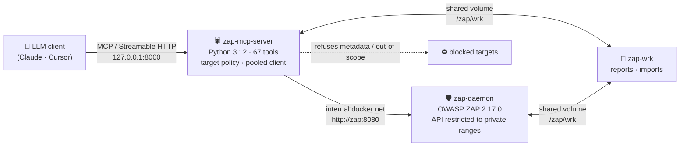

<div align="center">

# 🕷️ OWASP ZAP MCP Server

### Drive the world's most popular web app scanner from your AI assistant.

Point Claude, Cursor, or any [MCP](https://modelcontextprotocol.io) client at
**[OWASP ZAP](https://www.zaproxy.org/)** and run real crawls, authenticated
scans, and vulnerability triage — through **67 curated, safety-gated tools**
built straight from the [official ZAP API](https://www.zaproxy.org/docs/api/).

[](https://github.com/Neeraj829784/zap-mcp-server/actions/workflows/ci.yml)
[](LICENSE)
[](https://www.python.org/)
[](https://www.zaproxy.org/)
[](https://modelcontextprotocol.io)
[](https://docs.docker.com/compose/)

</div>

> [!WARNING]
> **Authorized use only.** Active scanning sends real attack payloads. Run it
> **only** against systems you have explicit, written permission to test.
> This server refuses cloud-metadata targets and can be pinned to an
> engagement scope — but the responsibility is yours.

---

## ✨ Why this exists

Talking to ZAP's raw REST API from an LLM is clumsy and risky: hundreds of
endpoints, no guardrails, and it's easy to point an attack at the wrong host.
This project gives your AI assistant a **small, opinionated, safe** surface:

<table>
<tr>
<td width="50%" valign="top">

**🔐 Safe by design**
- Cloud metadata endpoints (`169.254.169.254`) are **always** refused
- Optional scope allowlist + private-range blocking
- Control port bound to localhost by default

</td>
<td width="50%" valign="top">

**🔑 Real authenticated scanning**
- Full workflow: context → auth method → indicators → user → forced-user
- `scan_as_user` for spider, AJAX spider, and active scan
- The thing most ZAP wrappers skip entirely

</td>
</tr>
<tr>
<td width="50%" valign="top">

**🧱 Reliable under load**
- One pooled async client, bounded retries with backoff
- Typed errors + a uniform result envelope
- A single bad call can never crash the server

</td>
<td width="50%" valign="top">

**🚢 Production posture**
- Fail-closed config, secrets never logged
- Pinned, non-root, health-gated containers
- Green CI on every push

</td>
</tr>
</table>

---

## 🏗️ Architecture



- The MCP server reaches ZAP over the internal Docker network.
- Both ports are published on **`127.0.0.1` only** — nothing is world-exposed.
- Every state-changing ZAP action requires the API key.
- **Shared `/zap/wrk` volume.** ZAP resolves every file path in its API against
  its own filesystem, so both containers mount the same volume at the same path.
  This is what makes file-based tools work end to end: the agent stages an input
  (HAR, OpenAPI spec, URL list, automation plan) for ZAP to read, and reads back
  reports ZAP writes. A one-shot `wrk-init` service prepares the directory as
  `1000:1000` mode `2775` (setgid) before ZAP starts; the MCP server joins gid
  `1000` via `group_add`, so both unprivileged users can read and write there and
  new files inherit the shared group automatically.

---

## 🚀 Quick start

```bash
# 1. Set your secret (never committed)
cp .env.example .env
#    edit .env -> ZAP_API_KEY=<long-random-value>

# 2. Launch (ZAP starts, becomes healthy, then the MCP server starts)
docker compose up -d --build

# 3. Confirm
docker compose ps                    # both services: healthy
docker compose logs -f mcp-server    # "Registered 67 MCP tools"
```

Then point your MCP client at it:

```json
{
  "mcpServers": {
    "owasp-zap": { "url": "http://localhost:8000/mcp" }
  }
}
```

---

## 🔑 Authenticated scanning in 6 steps

The capability most ZAP wrappers skip — scan behind a login:

```text
1. create_context ─────────────► scope it (include app, exclude /logout)
2. set_authentication_method ──► e.g. formBasedAuthentication
3. set_logged_in / out_indicator
4. new_user → set_user_credentials → set_user_enabled
5. set_forced_user (+ mode)  ──► keeps the session alive during scans
6. spider_scan_as_user → active_scan_as_user
```

Prefer repeatable runs? Drive the whole pipeline with a ZAP
[Automation Framework](https://www.zaproxy.org/docs/automate/automation-framework/)
plan via `zap_run_automation_plan`.

---

## 🧰 The 67 tools

Tools marked 🎯 are gated by the target-authorization policy. Every tool returns
a uniform envelope: `{"status":"success",...}` or
`{"status":"error","code":...,"retryable":...}`.

<details>
<summary><b>Core &amp; crawling</b> (15)</summary>

| Group | Tools |
|---|---|
| Core & health | `get_version`, `access_url` 🎯, `get_sites`, `get_urls`, `new_session` |
| Spider | `spider_scan` 🎯, `spider_scan_as_user` 🎯, `spider_status`, `spider_results`, `spider_stop` |
| AJAX spider | `ajax_spider_scan` 🎯, `ajax_spider_scan_as_user` 🎯, `ajax_spider_status`, `ajax_spider_results`, `ajax_spider_stop` |

</details>

<details>
<summary><b>Scanning &amp; findings</b> (20)</summary>

| Group | Tools |
|---|---|
| Active scan | `active_scan` 🎯, `active_scan_as_user` 🎯, `active_scan_status`, `active_scan_progress`, `active_scan_stop`, `active_scan_pause`, `active_scan_resume`, `list_scan_policies` |
| Passive scan | `passive_scan_status`, `passive_scan_set_enabled`, `passive_scan_clear_queue` |
| Findings & triage | `get_alerts`, `get_alerts_summary`, `get_alert_details`, `get_number_of_alerts`, `delete_all_alerts`, `add_alert_filter`, `list_alert_filters`, `apply_alert_filters`, `retest_alerts` |

</details>

<details>
<summary><b>Auth, context, imports &amp; reports</b> (32)</summary>

| Group | Tools |
|---|---|
| Context & scope | `create_context`, `include_in_context`, `exclude_from_context`, `list_contexts`, `get_context`, `export_context`, `import_context` |
| Authentication | `get_auth_methods`, `get_auth_method_config_params`, `set_authentication_method`, `get_authentication_method`, `set_logged_in_indicator`, `set_logged_out_indicator` |
| Users | `new_user`, `set_user_credentials`, `set_user_enabled`, `list_users`, `get_user` |
| Forced user | `set_forced_user`, `set_forced_user_mode`, `get_forced_user`, `is_forced_user_mode_enabled` |
| Imports & automation | `import_openapi_url`, `import_openapi_file`, `import_graphql_url`, `import_har`, `import_urls`, `run_automation_plan`, `automation_plan_progress` |
| Reports | `list_report_templates`, `report_template_details`, `generate_report` |

</details>

> All tool names are prefixed with `zap_` (e.g. `zap_active_scan`).

---

## 🛡️ Security model

| Control | Behavior |
|---|---|
| **API key** | Required. Server won't start without `ZAP_API_KEY` (dev override: `ZAP_ALLOW_INSECURE=true`). Never logged. |
| **Metadata block** | `169.254.169.254`, `metadata.google.internal`, etc. are **always** refused. Not configurable. |
| **Scope allowlist** | `ZAP_TARGET_ALLOWLIST` pins attackable hosts to your engagement. |
| **Private-range block** | `ZAP_BLOCK_PRIVATE_TARGETS=true` refuses internal targets. |
| **Localhost binding** | MCP `:8000` and ZAP `:8080` publish on `127.0.0.1` only. |
| **Response caps** | Large lists are bounded (`max_response_items`) with `truncated` metadata. |

> [!IMPORTANT]
> The MCP endpoint has **no built-in auth** and can launch attacks. To expose it
> beyond localhost, set `MCP_BIND=0.0.0.0` **and** front it with an
> authenticating reverse proxy.

<details>
<summary><b>⚙️ Configuration reference</b></summary>

| Variable | Default | Description |
|---|---|---|
| `ZAP_API_KEY` | *(required)* | Must match the ZAP daemon's key. |
| `ZAP_BASE_URL` | `http://zap:8080` | ZAP API base URL. |
| `ZAP_TARGET_ALLOWLIST` | *(empty)* | Comma-separated allowed host suffixes. |
| `ZAP_BLOCK_PRIVATE_TARGETS` | `false` | Refuse private/loopback targets. |
| `MCP_BIND` | `127.0.0.1` | Host interface the MCP port binds to. |
| `REQUEST_TIMEOUT` / `CONNECT_TIMEOUT` | `60` / `10` | HTTP timeouts (s). |
| `ZAP_MAX_RETRIES` / `ZAP_RETRY_BACKOFF` | `2` / `0.5` | Retry policy. |
| `ZAP_MAX_RESPONSE_ITEMS` | `500` | Cap on returned list items. |
| `ZAP_REPORT_DIR` | `/zap/wrk` | Report output dir. Must be on the volume shared with ZAP. |

</details>

---

## 🧪 Development

```bash
python -m venv .venv && source .venv/bin/activate
pip install -r requirements-dev.txt
pytest -q          # policy, config, error envelope, tool behavior
```

CI runs `py_compile` + `pytest` on every push to `main`.

---

## ⚖️ Responsible use

Active scanning is an attack. In most jurisdictions, testing systems without
permission is illegal. Before you scan:

- ✅ Confirm the target is **in scope** for an engagement you're authorized to run
- ✅ Pin scope with `ZAP_TARGET_ALLOWLIST`; consider `ZAP_BLOCK_PRIVATE_TARGETS=true`
- ✅ Use a long random `ZAP_API_KEY`; never commit `.env`

Cloud metadata endpoints are always refused and this cannot be overridden.

---

## 📄 License

[MIT](LICENSE) © Neeraj829784 — swap the `LICENSE` file for Apache-2.0 if you
want an explicit patent grant.

<div align="center"><sub>Built for authorized penetration testing &amp; bug-bounty work. Hack responsibly. 🛡️</sub></div>
